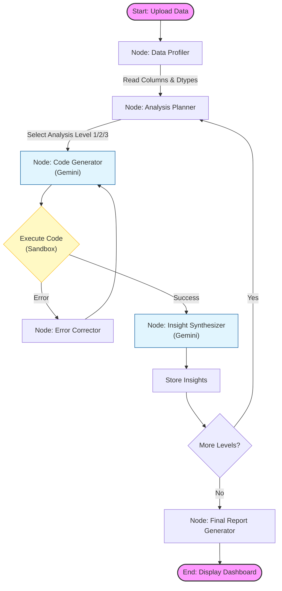

# Insight-3
An autonomous LLM agent that ingests structured data (CSV/Excel/Parquet), iteratively writes and executes Python code to explore relationships, and generates insights at three distinct levels of complexity (Univariate, Bivariate, and Trivariate).

---

## Functional Requirements (The 3 Levels)
The agent must strictly follow this hierarchical analysis process:

### **Level 1: Univariate Analysis (Column Profiling)**
* **Goal:** Characterize every single column independently.
* **Logic:**
* *Continuous:* Calculate Min, Max, Mean, Median, Std Dev, Distribution shape.
* *Discrete/Categorical:* Get Unique counts, Top 5 most frequent values with percentages.
* *Missing Data:* Count and percentage of nulls.

### **Level 2: Bivariate Analysis (Pairwise Relationships)**
* **Goal:** Identify strong correlations or conditional rules between *pairs* of columns ($A \rightarrow B$).
* **Logic:** Generate Python code to calculate correlation matrices (Pearson/Spearman) or run Chi-Square tests.
* **Output Format:** "If `Column A` is [Condition], then `Column B` tends to be [Result]."
* *Example:* "If AGE > 18, then DRIVING_LICENSE is likely YES."

### **Level 3: Trivariate Analysis (Multi-Factor Interactions)**
* **Goal:** Detect complex patterns involving *three* variables ($A + B \rightarrow C$).
* **Logic:** Look for confounding variables or interaction effects (e.g., using Decision Trees or multi-variable grouping).
* **Output Format:** "If `Column A` is [Condition 1] AND `Column B` is [Condition 2], then `Column C` is [Result]."
* *Example:* "If AGE > 18 AND DRIVING_LICENSE is YES, then INCOME > 10,000 SEK."

---

## Technical Architecture & Stack
This project uses a following stack: 

* **Package Manager:** `uv`
* **Development Notebook:** `marimo`
* **Orchestration:** `LangGraph`
* **LLM Provider:** Google Gemini (via Gemini API)
* **Tools:** `LangChain` Community Tools
* **Testing:** **`pytest`**

---

## User Flow (Mermaid Diagram)

This diagram visualizes the LangGraph state machine your developer needs to build.

---

### Recommended Initial Prompts (System Instructions)

Give these prompt guidelines to your developer to ensure the LLM behaves correctly:

**Role:**

> "You are an Expert Python Data Analyst. You do not guess; you verify. You answer questions by writing executable Python code using `pandas`, executing it, and interpreting the printed output."

**Constraint Checklist for Level 3 Analysis:**

> "When looking for Level 3 insights (3 variables), avoid stating the obvious. Focus on 'Interaction Effects' where the relationship between A and C changes depending on B. Use decision tree logic (e.g., `sklearn.tree.DecisionTreeClassifier` with max_depth=3) to find these splits automatically."

---